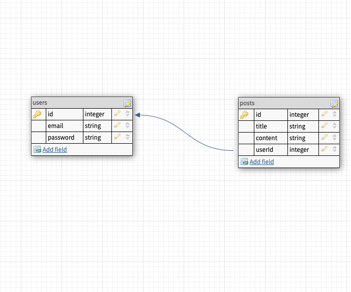
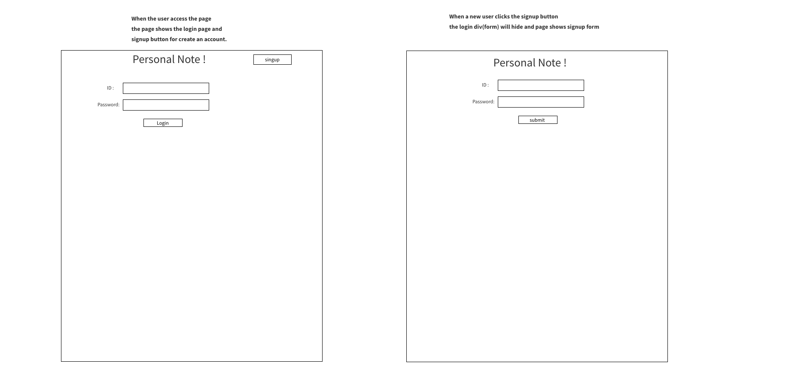
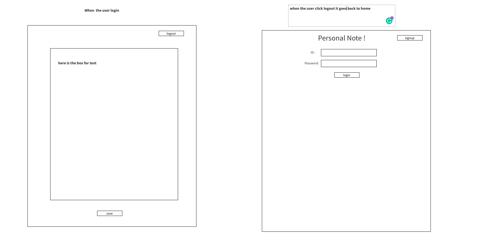

Frontend

# Private Notebook

## summary of the application.
The goals of this application are to create a personal account, and user can post the personal post and can delete it.  This project has two tables “users” and “post” and they have one(user) to many(post) relationship between each other. 

## Diagram

## User Story
When the user goes to the main page, the user can see the login section and signup button.
If the user already signup before, the user can log in with the id and password.
If the user doesn’t have an account, the user clicks the signup button to go to a signup form.
After the user sing-in the homepage, the user can see the writable section, save button and, delete button. When the user clicks the log-out button, the user goes back to a landing page.

## Wirefram

## MVP of Private Notebook
- Create user fuction
- Login function
- Post function(text of the post)
- Post must be saved in the local server
- the form and div must change when button clicked (singup, logout)
- Delete the post

## Stretch
- CSS
- User profile
- List of the post
